##  스프링 시큐리의 의존성 추가시 무엇이 일어나는가?
+ WAS 실행시 스프링 시큐리티의 초기화 작업 및 보안 설정이 진행된다.
+ 별도의 설정이 구현을 하지 않아도 기본적인 웹 보안 기능이 현재 시스템에 연동되어 작동한다
  + 모든 요청은 인증이 되어야 접근
  + 인증 방식은 form방식과 httpBasic 로그인 방식을 제공한다.
  + 기본 로그인 페이지 제공
  + 기본계종 한개를 제공
    + user / console에 출력
    + 

## 아키텍처 
 
+ WebSecurityConfigurerAdapter.java
  + 스프링 시큐리티의 웹 보안 기능 초기화 및 설정을 담당한다.


+ SecurityConfig.java
  + 사용자 정의 보안 설정 클래스 
  

+ HttpSecurity.java
  + 세부적인 보안 기능을 설정하는 API 제공 
  + 인증API, 인가 API를 가지고 있따.


## Form 인증 
1. client get/home을 요청 
2. 인증이 안되면 로그인페이지로 리다이렉트 
3. client post/login
4. session 및 인증 토큰 생성 및 저장 
5. client에서 요청시 서버에 저장된 세션 정보를 가지고서 접근 

```java
@Configuration
@EnableWebSecurity
public class SecurityConfig extends WebSecurityConfigurerAdapter {

  @Override
  protected void configure(HttpSecurity http) throws Exception {
    http
            .formLogin()
            .loginPage("사용자 정의 페이지")
            .defaultSuccessUrl("로그인 성공후 이동 페이지")
            .failureUrl("로그인 실패 후 이동 페이지")
            .usernameParameter("아이디 파라미터명 설정")
            .passwordParameter("패스워드 파라미터명 설정")
            .loginProcessingUrl("로그인 Form Action Url")
            .successHandler("로그인 성공 후 핸들러")
            .failureHandler("로그인 실패 후 핸들러");
  }
}
```

### 이를통해 알게된점
오류정의    
junit test시 아래와 같은 오류가 발생한 이유는 url path앞단에 '/' 를 붙여야 한다
SecurityConfig에서도 **loginProcessingUrl** 도 '/'를 반드시 붙여만 정상적으로 테스트가 가능하다.

>'url' should start with a path or be a complete HTTP URL: login-proc
>

## UserNamePasswordAuthenticationFilter에 대해 알아보자

### Login Form 인증  Flow
1. UserNamePasswordAuthenticationFilter가 최초로 유저의 요청정보를 가지고 매칭되는지 요청

```java
 abstract class AbstractAuthenticationProcessingFilter {
    private void doFilter(HttpServletRequest request, HttpServletResponse response, FilterChain chain)
            throws IOException, ServletException {
        // AntPathRequestMatcher login으로 요청인지 확인
        if (!requiresAuthentication(request, response)) {
            chain.doFilter(request, response);
            return;
        }
        try {
            //UsernamePasswordAuthenticationToken을 통해 Authentication 정보를 Provider에게 위임
            Authentication authenticationResult = attemptAuthentication(request, response);
            if (authenticationResult == null) {
                // return immediately as subclass has indicated that it hasn't completed
                return;
            }
            this.sessionStrategy.onAuthentication(authenticationResult, request, response);
            // Authentication success
            if (this.continueChainBeforeSuccessfulAuthentication) {
                chain.doFilter(request, response);
            }
            successfulAuthentication(request, response, chain, authenticationResult);
        } catch (InternalAuthenticationServiceException failed) {
            this.logger.error("An internal error occurred while trying to authenticate the user.", failed);
            unsuccessfulAuthentication(request, response, failed);
        } catch (AuthenticationException ex) {
            // Authentication failed
            unsuccessfulAuthentication(request, response, ex);
        }
    }
}
```
2. AntPathRequestMatcher("/login") login과 매칭되는지 확인
   + 매칭이 안 된 경우 
     + chain.doFilter(다음필터를 실행)
   + 매칭이 된 경우  
3. Authentication (username,password)를 가지고서 인증요청
4. AuthenticationManager는 AuthenticationProvider에게 위임
5. AuthenticationProvider에서 인증처리
   + 인증실패 
     + AuthenticationException 발생
   + 인증성공
6. Authentication(User + Authorities) 에 대해 저장 요청
7. SecurityContext에 저장 
8. SuccessHandler();

## 2.로그아웃 처리 LogoutFilter

```java

@Configuration
@EnableWebSecurity
public class SecurityConfig extends WebSecurityConfigurerAdapter {

    @Override
    protected void configure(HttpSecurity http) throws Exception {
        http
                .logout()
                .logoutUrl("로그아웃 처리 url")
                .logoutSuccessUrl("/login")
                .deleteCookies("로그아웃 후 쿠키 삭제")
                .addLogoutHandler("로그아웃핸들러")
                .logoutSuccessHandler("로그아웃 성공후 핸들러")
        ;
    }
}
```
### Logout flow
1. 사용자가 logout 요청
2. AntPathRequestMatcher(/logout)
    + 매칭이 안 된 경우
        + chain.doFilter(다음필터를 실행)
    + 매칭이 된경우 
3. Authentication 가 인증된 객체정보를 securityContext에서 가져온다.
4. SecurityContextLogoutHandler
    + 세션무효화
    + 쿠키삭제
    + SecurityContextHolder.clearContext()를 호출해서 저장된정도 삭제한다.
5. SimpleUrlLogoutSuccessHandler로 로그인페이지로 이동

### LogoutFilter 기본 Handler
1. CookieCleaningLogoutHandler // 쿠키삭제
2. CsrfLogoutHandler
3. SecurityContextLogoutHandler // 세션삭제
4. LogoutSuccessEventPublishingLogoutHandler
    + 우리가 만든 핸들러를 호출한다.

## 3. Remember ME 인증 및 RememberMeAuthenticationFilter
> 세션이 만료되고 웹 브라우저가 종료된 후에도 어플리케이션이 사용자를 기억하는 기능    
> Remember-me 쿠키에 대한 http요청을 확인한 후 토큰 기반 인증을 사용해 유효성을 검사하고 토큰이 검증되면 사용자는 로그인된다.

### 설정방법 

```java

@Configuration
@EnableWebSecurity
public class SecurityConfig extends WebSecurityConfigurerAdapter {

    @Override
    protected void configure(HttpSecurity http) throws Exception {
        http
                .rememberMe()
                .rememberMeParameter("기본파라미터 명은 remember-me")
                .tokenValiditySeconds("기본 값은 14일")
                .alwaysRemember("리멤버미 기능이 활성화되지 않아도 항상실행")
                .userDetailsService("userDetailsService")
        ;
    }
}
```

### Remember-me flow
1. 사용자의 요청을 하지만 세션이 만료된 상태에서 요청을 합니다.
   + 사용자는 remember-me를 통해 로그인을 시도했습니다.
2. RememberMeAuthenticationFilter
   1. 아래와 같은 경우 작동하게 됩니다.
      1. Authentication null 
         + 사용자의 세션이 만료
         + SecurityContext  Authentication 없는경우
         + Null이 아닌경우는 해당 정보가 존재하는 것으로 판단하여 작동하지 않습니다.
      2. form 인증 rememer-me 쿠키를 발급 받아서 전송하는 경우
3. RememberMeService
   1. TokenBeasedRememberMeService
      + 14일 만료기간 
   2. PersistentTokenBasedRememberMeService
      + db에 저장 
4. Token Cookie 를 추출 
5. Token 존재한다면 
   + 존재하지 않는다면 
     + chain.doFilter(다음필터를 실행)
6. DecodeToken(정상유무 판단) 규칙체크 
   1. 조건에 부합하지 않는다면 Exception 발생
      1. Token 이 서로 일치하는가? 
      2. User 계정이 존재하는가? 
      3. 새로운 Authentication 생성 
      4. AuthenticationManager 인증처리
      
## 4.익명사용자 AnonymousAuthenticationFilter

> 익명사용자 인증 필터   
> 익명사용자와 인증사용자를 구분해서 처리하기 위한 용도로 사용   
> 화면에서 인증여부를 구현할 때 isAnonymous()와 isAuthenticated()로 구분해서 사용    
> 인증 객체를 세션에 저장하지 않는다.

1. 사용자가 요청을 보냄 
2. AnonymousAuthenticationFilter
   + Authentication 가 존재하지 않는다면 (인증하지 않은 사용자)
     + AnonymousAuthenticationToken을 생성
   + 인증한 사용자라면 
     + chain.doFilter(다음필터를 실행)
3. SecurityContextHolder에 익명객체를 저장처리

### 정리

1. 인증이 되기 전이나, 이후 의 사용자 모두 유효한 인증토큰을 갖고있지 못하면 `익명 사용자`이다

2. `익명 사용자`는 로그인이 가능한 경로를 통해 인증허가를 을 받게 될 경우, 일반 사용자로 등극하여, 로그인 접속 및 향후 접속유지가 가능하게된다.

3. 인증을 받지 못한 사용자는 `익명 사용자`로 분류되어, `익명 사용자` 인증 토큰이(인증 객체) 익명 사용자 관리 명목으로 생성되지만, 로그인과 관련된 접근 권한은 없다(세션 생성이 되지않음) -> `redirect /login page`

4. `익명 사용자` 전용으로 발급된 인증토큰을 통해, 향후 `익명 사용자` 접근 여부를 관리 할 수 있다


## 5. 동시세션 제어 
1. 최대 허용 개수(1개)를 사용자가 초과한경우 
   + 이전 사용자 세션만료 
     + 사용자1 로그인 -> 사용자 세션생성 
     + 사용자2 로그인 -> 세션 생성 사용자1세션 만료 
     + 사용자1은 세션 만료로 인하여 조회 불가능 
   + 현재 사용자 인증 실패 
     + 사용자1 로그인 -> 사용자1 세션생성 
     + 사용자2 로그인 -> 사용자1이 가지고 있기 때문에 사용자2는 예외발생

```java
@Configuration
@EnableWebSecurity
public class SecurityConfig extends WebSecurityConfigurerAdapter {

    @Override
    protected void configure(HttpSecurity http) throws Exception {
        http
                .sessionManagement()
                .maximumSessions("최대 허용 가능 세션수 , -1인경우 무제한 로그인세션허용")
                .maxSessionsPreventsLogin("동시로그인 차단, false : 기존세션 만료, true : 예외던짐")
                .expiredUrl("세션이 만료된 경우 이동할 페이지")
        ;
    }
}
```

### 5.세션 고정보호
1. 공격자가 서버로 공격을 시도합니다.
2. 공격자에 의한 세션정보를 사용자에게 쿠키를 심어 놓습니다.
3. 사용자는 공격자가 가진 세션 쿠키를 가지고 로그인을 시도하면 인증에 성공하게되며 
4. 사용자의 세션정보를 공격자도 동일하게 공유하게 됩니다.

#### 위와 같은 공격을 방어를 해야합니다. 
어떻게 방어를 해야할까요 ? 
1. 사용자가 인증을 할 때마다 새로운 세션이 생성되도록 처리하면됩니다.
```java
@Configuration
@EnableWebSecurity
public class SecurityConfig extends WebSecurityConfigurerAdapter {

    @Override
    protected void configure(HttpSecurity http) throws Exception {
        http
                .sessionManagement()
                .sessionFixation().changeSessionId(); // 기본값 {
        // none,
        // changeSessionId servlet 3.1 이상 이전 세션값 사용
        // migrateSession, servlet 3.1 이하 이전 세션값 사용
        // newSession 이전의 세션값을 사용하지 못함
        // }
        ;
    }
}

```

### 5. 세션정책
+ SessionCreationPolicy.IF_REQUIRED (기본값)
+ 스프링시큐리티가 항상세션생성
  + SessionCreationPolicy.Always
+ 스프링 시큐리티가 생성하지 않지만 이미 존재하면 사용
  + SessionCreationPolicy.Never
+ 스프링 시큐리티가 생성하지 않고 존재해도 사용하지 않음
  + SessionCreationPolicy.Stateless
    + + jwt에서 사용
```java
@Configuration
@EnableWebSecurity
public class SecurityConfig extends WebSecurityConfigurerAdapter {

    @Override
    protected void configure(HttpSecurity http) throws Exception {
        http
                .sessionManagement()
                .sessionCreationPolicy(SessionCreationPolicy.IF_REQUIRED)
        ;
    }
}

```


### SessionManagementFilter
1. 세션관리
   + 인증시 사용자의 세션정보를 등록 조회 삭제 등의 세션 이력을관리
2. 동시적 세션제어 
   + 동일 계정으로 접속이 허용되는 최대 세션 수를 제한
3. 세션고정보호
   + 인증할 때마다 세션쿠키를 새로발급하여 공격자의 쿠키조작을방지
4. 세션생성정책
   + Always, IF_Required,Never,Stateless

###  ConcurrentSessionFilter

+ 매 요청마다 현재 사용자의 세션 만료 여부 체크
+ 세션이 만료되었을 경우 즉시 만료처리 
+ session.isExpired () == true
  + 로그아웃
  + 즉시 오류페이지 응답

### flow
1. `사용자1` 로그인 요청 
2. `UsernamePasswordAuthenticationFilter`가 `ConcurrentSessionControlAuthenticationStrategy`를 호출합니다.
   + ConcurrentSessionControlAuthenticationStrategy
     + 동시성 세션을 처리하는 클래스 
     + 인증을 시도하는 `사용자1`의 session 수가 몇 개인지 확인을 한다.
   + ChangeSessionIdAuthenticationStrategy
     + 세션고정보호를 처리하는 클래스 
     + `사용자1`이 인증시도할 때는 새로운 session와 쿠키를 발급합니다.
   + RegisterSessionAuthenticationStrategy
     + 사용자의 세션의 정보를 저장하는 클래스 
     + 사용자 세션정보의 수가 1로 증가하게 된다.
3. `사용자2` 로그인 요청
   + ConcurrentSessionControlAuthenticationStrategy
     + sessionCount == maxSession 수가 같은경우
       + 인증실패 전략인 경우
         + SessionAuthenticationException
       + 세션 만료 전략인 경우
         + session.expireNow();
         + ChangeSessionIdAuthenticationStrategy 클래스
           + session.changeSessionId();
         + RegisterSessionAuthenticationStrategy 클래스 
           + 세션정보등록
4. `사용자1`이 다시 요청하는경우 
   + ConcurrentSessionsFilter는 매요청마다 확인 
     + session.isExpired 로 확인 `ConcurrentSessionControlAuthenticationStrategy`에게 확인
   + logout & 메시지 전송


## 6. 권한 설정 및 표현식
설정시 구체적인 경로가 먼저오고 그것보다 큰 범위의 경로가 뒤에 오도록해야한다. 

1. antMatchers 
   + 경로설정 
2. hasRole 
   + 해당 권한을 가졌는가? 
3. access
   + 조금 더 구체적인 표현식을 통해 처리할 수있다.
   ```java
    http.antMatchers("/**").access("hasRole('ADMIN') or hasRole('SYS')")
    ```

|메소드|동작|
|:---:|:---:|
|hasRole()|사용자가 주어진 `역할`이 있다면 접근을 허용|
|hasAuthority()| 사용자가 주어진 `권한`이 있따면 접근허용|
|hasAnyRole()| 사용자가 주어진 `역할`이 있다면|
|hasAnyAuthority| 사용자가 주언진 `권한`중 어떤 것이라도 있다면 접근|
|hasIpAddress | 주어진 IP로부터 요청이 왔다면 접근을 허용 |


### 인메모리 사용자 생성 방법 

```java
@Configuration
@EnableWebSecurity
public class SecurityConfig extends WebSecurityConfigurerAdapter {

    @Override
    protected void configure(AuthenticationManagerBuilder auth) throws Exception {
        auth.inMemoryAuthentication().withUser("user").password("{noop}1234").roles("USER")
                .and()
                .withUser("sys").password("{noop}1234").roles("SYS")
                .and()
                .withUser("admin").password("{noop}1234").roles("ADMIN");
    }
}
```

## 7. ExceptionTranslationFilter 

### AuthenticationException
 + 인증 예외처리 
   + 로그인 페이지 이동, 401 오류코드 전달
 + 인증 예외가 발생하기 전의 요청정보를 저장 
   + RequestCache 사용자의 이전 요청 정보를 세션에 저장하고 이를 꺼내 오는 매커니즘 
     + SavedRequest 사용자가 요청했던 request 파라미터 값들 , 그 당시의 헤더 값들 등이 저장 
### AccessDeniedException
 + 인가 예외 처리 
   + AccessDeniedHandler 에서 예외 처리하도록 제공 


### flow
1. 사용자가 `request(/user)`를 요청
2. FilterSecurityInterceptor 
   + 인증 된 사용자가 아닌 경우 `AuthenticationException` 을 발생 
      + `AuthenticationEntryPoint` 에서 로그인 페이지로 이동 
      + 사용자의 요청관 정보를 저장 
        + `HttpSessionRequestCache` 에서 관리 
        + Session에 담긴 DefaultSavedRequest 객체 정보 `HttpSessionRequestCache`가 관리한다.
   + 인증은 되었지만 인가 정보가 다른 경우 
     + `AccessDeniedException` 발생 
       + AccessDeniedHandler 클래스를 호출해서 `response.redirect("인가 처리페이지")`로 보낸다.

### 설정방법 

```java
@Configuration
@EnableWebSecurity
public class SecurityConfig extends WebSecurityConfigurerAdapter {

    @Override
    protected void configure(HttpSecurity http) throws Exception {
        http
                .exceptionHandling()
                .authenticationEntryPoint("인증 실패시 처리")
                .accessDeniedHandler("인가 실패시 처리")
        
                .formlogin()
                .successHandler((request, response, authentication) -> {
                    // 세션에 담겨진 요청했던 주소로 이동 시킴
                    RequestCache requestCache = new HttpSessionRequestCache();
                    SavedRequest savedRequest = requestCache.getRequest(request, response);
                    response.sendRedirect(savedRequest.getRedirectUrl());
                })
        ;
    }
}
```

## 8.RequestCacheAwareFilter
+ 미리 저장된 캐싱된 데이터를 담고 활용할 수 있도록 하는 필터 
1. 사용자가 인증 없이 요청하는경우 `NULL`인 상태
2. 이후 `ExceptionTranslateFilter`에서 예외처리를 담당하면서 이전에 유저가 요청한 정보 `HttpSessionRequestCache` 에서 관리하게 된다.
3. 이후 사용자가 다시 요청을 시도하는 경우 `RequestCacheAwareFilter`는 더 이상 NULL이 아니며 이전에 요청한 사용자의 정보를 가지고서 다음 필터에게
4. 해당 정보를 넘겨주게된다.
### 설정정보 
```java
@Configuration
@EnableWebSecurity
public class SecurityConfig extends WebSecurityConfigurerAdapter {

    @Override
    protected void configure(HttpSecurity http) throws Exception {
        http
                .formlogin()
                .successHandler((request, response, authentication) -> {
                    // 세션에 담겨진 요청했던 주소로 이동 시킴
                    RequestCache requestCache = new HttpSessionRequestCache();
                    // 사용자가 인증 받기전에 요청했던 정보를 가지고있는 객체 
                    SavedRequest savedRequest = requestCache.getRequest(request, response);
                    response.sendRedirect(savedRequest.getRedirectUrl());
                })
        ;
    }
}
```

## CSRF, CsrfFilter
1. `사용자`가 쇼핑몰로 로그인함으로써 쿠키를 받습니다. `http://shop.naver.com`
2. `공격자`가 사용자에게 링크를 이용자에게 전달하게 됩니다. `http://shop.naver.com/adress=공격자집주소`
3. `사용자`는 링크를 클릭함으로써 사용자의 승인이나 인지 없이 배송지가 등록된다.
4. 위 문제를 해결하기 위해서 `CsrfFilter` 이용할 수 있다.

## CsrfFilter 무엇인가
+ 모든 요청에 래덤하게 생성된 토큰을 HTTP 파라미터로 요구 
+ 요청시 전달되는 토큰값과 서버에 저장된 실제 값과 비교한 후 만약 일치하지 않으면 요청은 실패한다.
  + HTTP  메소드 `PATCH,POST,PUT,DELETE`로 요청하는 경우 `토큰`값과 `토큰파라미터이름`을 가지고서 요청해야합니다.


# 스프링 시큐리티 주요 아키텍처

## 1. DelegatingProxyChain

1. Servlet Filter 스프링의 Bean을 사용할 수 없다. 
2. `DelegatingFilterProxy`를 이용하여 `Servlet Filter` 에서 `Spring Bean` 사용이 가능하게 한다.
   + `springSecurityFilterChain` 이름으로 생성된 빈을 `ApplicationContext` 에서 찾아 요청을 위임할 수 있게된다.

## FilterChainProxy
+ 지금 까지 나열된 Filter 관리 
+ `DelegatingFilterProxy`으로 부터 요청을 위임받는 `FilterChainProxy` 실제 보안 처리 
+ `springSecurityFilterChain`의 이름으로 생성되는 필터 빈 
+ 스프링 시큐리티 초기화 시 생성되는 필터들을 관리하고 제어 
  + 스프링 시큐리티가 기본적으로 생성하는 필터 
  + 설정 클래스에서 API 추가 시 생성되는 필터 
+ 사용자의 요청을 필터 순서대로 호출하여 전달 
+ 사용자 정의 필터를 생성해서 기존의 필터 전,후로 추가 가능 
  + 필터의 순서 정의 
+ 마지막 필터까지 인증 및 인가 예외가 발생하지 않으면 보안 통과

## flow 
1. 사용자가 요청
2. `Servlet Container` 에서 `DelegatinFilterProxy` 필터가 `SpringContainer`의 `SpringSecurityFilterChain` 에게 위임을 요청하게 된다.
```xml
<filter>
    <filter-name>springSecurityFilterChain</filter-name>
    <filter-class>org.springframework.web.filter.DelegatingFilterProxy</filter-class>
</filter>

<filter-mapping>
  <filter-name>springSecurityFilterChain</filter-name>
  <url-pattern>/*</url-pattern>
</filter-mapping>
```
3. `springSecurityFilterChain` 이 가지고 있는 bean `FilterChainProxy` 이다.

## 과정을 확인해보자
1. Sprin 시작
2. `SecurityFilterAutoConfiguration` 에서 `DelegatingFilterProxy` bean을 등록한다.
```java
public class SecurityFilterAutoConfiguration {
    @Bean
    @ConditionalOnBean(name = DEFAULT_FILTER_NAME)
    public DelegatingFilterProxyRegistrationBean securityFilterChainRegistration(
            SecurityProperties securityProperties) {
        // bean 등록
        DelegatingFilterProxyRegistrationBean registration = new DelegatingFilterProxyRegistrationBean(
                DEFAULT_FILTER_NAME);
        registration.setOrder(securityProperties.getFilter().getOrder());
        registration.setDispatcherTypes(getDispatcherTypes(securityProperties));
        return registration;
    }
}
```
3. `WebSecurityConfiguration`에서 `DEFAULT_FILTER_NAME`으로 bean 을생성하는데 실제 bean은 `WebSeuciry.performBuild()`에서 FilterChainProxy 빈을 생성한다.

4. 실제 사용자가 요청 
5. `DelegatingFilterProxy` 에서 webApplicationContext를 통해 해당되 `DEFAULT_FILTER_NAME`의 빈을 찾아서 해당 bean 담겨진 무수한 filter들을 처리하게 된다.

## 2. 필터 초기화와 다중 설정 클래스

+ 설정클래스 별로 보안 기능이 각각 작동 
+ 설정 클래스 별로 RequestMatcher 설정 
  ```java
    http.antMatcher("/admin/**")
    ```
+ 설정 클래스 별로 필터가 생성 
+ 각각의 설정들은 `Filter` 정보,`RequestMacher` 정보를 가지는 `SecurityFilterChain` 클래스를 생성하게 됩니다.
+ 여러개의 `SecurityFilterChain`은  `FilterChainProxy`가 `SecurityFilterChains`으로 각각의 chain 정보를 가지게 됩니다.

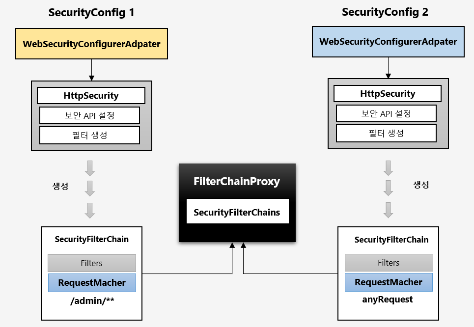

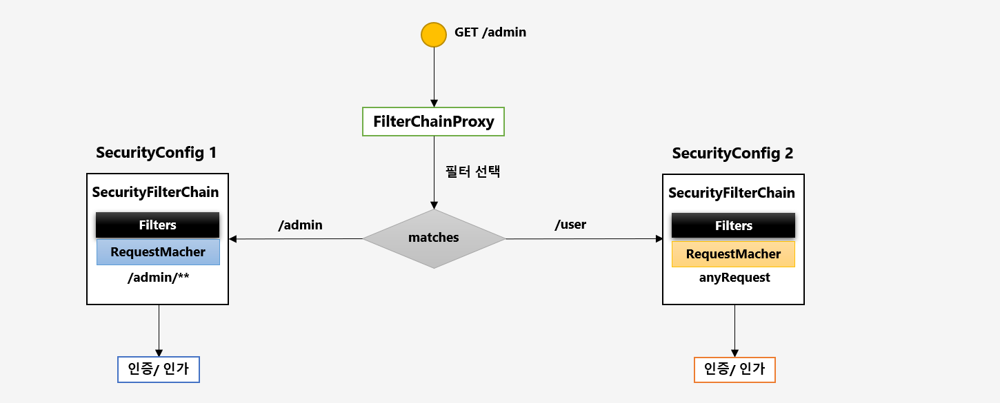

```java
public class FilterChainProxy {
    private List<Filter> getFilters(HttpServletRequest request) {
            int count = 0;
            for (SecurityFilterChain chain : this.filterChains) {
                if (logger.isTraceEnabled()) {
                    logger.trace(LogMessage.format("Trying to match request against %s (%d/%d)", chain, ++count,
                            this.filterChains.size()));
                }
                // 각각의 필터정보들증 matches와 동일한 설정정보를 가진 필터 정보를 가져와서 필터를 처리하게 됩니다.
                if (chain.matches(request)) {
                    return chain.getFilters();
                }
            }
            return null;
        }
}
``` 

## 오류
+ 두개를 설정하는 경우 순서를 달리해야한다는 exception 발생    
  + @Order on WebSecurityConfigurers must be unique. Order of 100 was already
+ 설정시에 anyRequest로 전체 범위를 먼저 설정하는 경우 

## 설정방법
+ 위 설정 방법은 `.antMatcher("/admin/**")` 특정 URL 을 기준으로 설정을 처리했으며 
+ 아래 설정은은 모든 인증 방식에 대해서 permitAll처리했다.
+ **다중설정을 할 경우에는 더 넓은 범위의 패턴을 뒤로 둬야한다.**   
그 이유는 설정의 순서에 따라 탐색을 하게 되는데 더 넓은 범위를 먼저 체크하게 된다면 더 좁은 범위의 설정 부분을 체크하지 못하고 인증 없이 다른 사용자가 접근이 가능하게 되는 것이다. 
```java
@Configuration
@EnableWebSecurity
@Order(0)
public class AdminSecurityConfig extends WebSecurityConfigurerAdapter {

    @Override
    protected void configure(HttpSecurity http) throws Exception {
        http
                .antMatcher("/admin/**")
                .authroizeRequest()
                .anyRequest().authenticated()
                .and()
                .formLogin();
        ;
    }
}

@Configuration
@Order(1)
public class DefaultSecurityConfig extends WebSecurityConfigurerAdapter {

    @Override
    protected void configure(HttpSecurity http) throws Exception {
        http
                .authroizeRequest()
                .anyRequest().permitAll()
                .and()
                .formLogin();
    }
}
```

## 3. Authentication (인증주체)

+ 요청하는자가 누구인지 증명
  + 사용자의 인증정보를 저장하는 토큰 개념 
  + 인증시 id와 password를 담고 인증 검증을 위해 전달되어 사용된다. 
  + `인증 후` 최종 인증결과(user 객체, 권한정보)를 담고 SecurityContext에 저장되어 전역적으로 참조가 가능합니다.
  ```java
    Authentication authentication = SecurityContextHolder.getContext().getAutentication();
    ```
### 구조
|용어|용도|
|:---:|:---:|
|principal|사용자 아이디 혹은 User객체를 저장|
|credentials|사용자 비밀번호|
|authorities| 인증된 사용자의 권한 목록|
|details| 인증부가정보|
|Authenticated|인증여부|

### flow 

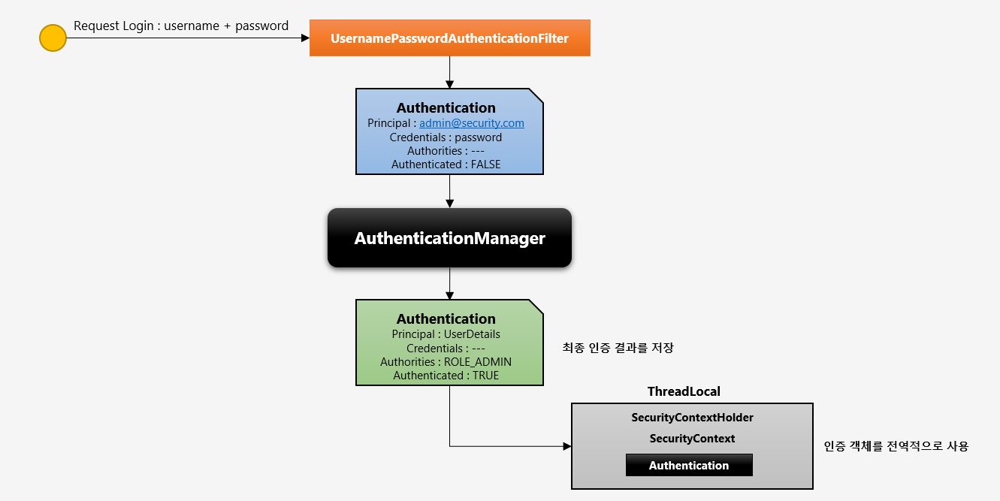
1. 사용자가 로그인/패스워드 를 요청
2. `UsernamePasswordAuthenticationFilter` 인증 필터가 요청정보받아서 `Authentication` 를 생성합니다.
3. `Authentication`은 요청정보를 저장 
4. `AuthenticationManager`가 인증을 성공하면 `Authentication` 객체를 생성 (최종정보)
```java
	@Override
	public Authentication attemptAuthentication(HttpServletRequest request, HttpServletResponse response)
			throws AuthenticationException {
		if (this.postOnly && !request.getMethod().equals("POST")) {
			throw new AuthenticationServiceException("Authentication method not supported: " + request.getMethod());
		}
		String username = obtainUsername(request);
		username = (username != null) ? username : "";
		username = username.trim();
		String password = obtainPassword(request);
		password = (password != null) ? password : "";
		UsernamePasswordAuthenticationToken authRequest = new UsernamePasswordAuthenticationToken(username, password);
		// Allow subclasses to set the "details" property
		setDetails(request, authRequest);
		// Manager에게 전달
		return this.getAuthenticationManager().authenticate(authRequest);
	}
```
5. `SecurityContextHolder` 관리하는 `SecurityContext` 객체 안에 `Authentication` 저장

### abstractSecurityInterceptor 
+ 인가 처리를 하는 필터의 부모 클래스


## 인증저장소 SecurityContextHolder, SecurityContext

### SecurityContext
+ `Authentication` 객체가 저장되는 보관소(`User 정보는 Authentication객체에 저장`)로 필요시 **언제든지** `Authentication` 객체를 꺼내어 쓸 수 있도록 제공되는 클래스 
+ `ThreadLocal` 에 `SecurityContext`가 저장되어 아무 곳에서나 참조가 가능하도록 설계함 
  + Thread 마다 고유한 저장소를 가지는 공간
  + 다른 스레드와 공유되지 않는다.
+ 인증이 완료되면 `HttpSession`에 저장되어 어플리케이션 전반에 걸쳐 전역적인 참조가 가능하다.
  + 저장하는 `Filter`:  `SecurityContextPersistenceFilter`

#### 구조 
+ `SecurityContextImpl` 가 구현되어있음 

### SecurityContextHolder
+ `SecurityContext` 를 감싸고 있다. 
  + `MODE_THREADLOCAL` : 스레드당 ScurityContext 객체를 할당 (기본값)
  + `MODE_INHERITABLEHREADLOCAL` : 메인 스레드와 자식 스레드에 관하여 동일한 Security Context 유지
    + `Process`가 동작하면 하나의 main `Thread`가 생성된다. 
      + 기능 안에서 별도의 `Thread`를 생성하게된다. 
      + `MainTrehad`와 `자식Thread`와 공유가 되지 않기 때문에 이와같은 설정으로 사용할 수 있다. 
  + `MODE_GLOBAL` : 응용 프로그램에서 단 하나의 SecurityContext 저장 
    + `ThreadLocal` 방식이 아닌 `static`에 저장하는 방식 
+ `SecurityContextHolder.clearContext` : SecurityContext 기존정보 초기화

```java
@GetMapping("/thread")
   public String thread() {
   new Thread(() -> {
   Authentication authentication = SecurityContextHolder.getContext().getAuthentication();
   });
   return "thread";
}
```


#### 구조 
+ `ThreadLocalSecurityContextHolderStrategy`를 사용
  + `TheradLocal`를 조회,저장,삭제

### flow 

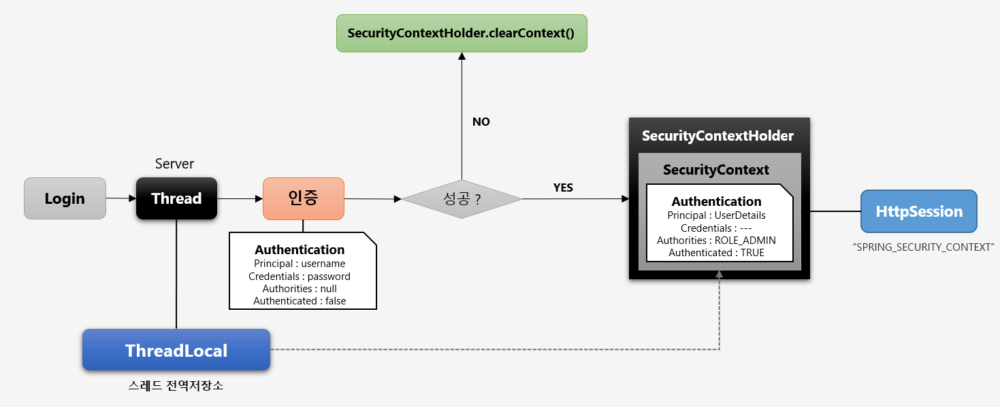

1. 사용자가 로그인요청 
   1. `서버` 하나의 Thread 생성 `ThreadLocal`
      + 인증 처리를 진행 
        + `Authentication` 사용자의 정보를 저장 
        + 실패
        + 성공 
          + `Authentication` 정보를 `SecurityContext` 저장
          + `SecurityContextHolder`를 `SecurityContext` 저장  (SecurityContext는 `ThreadLocal`안에 저장되어짐)
            + HttpSession에 최종적으로 `SPRING_SECURITY_CONTEXT` 이름으로 저장 
```java
   @GetMapping("/")
   public String index(HttpSession session) {
       Authentication authentication = SecurityContextHolder.getContext().getAuthentication();
       SecurityContext authentication2 = (SecurityContext) session.getAttribute(HttpSessionSecurityContextRepository.SPRING_SECURITY_CONTEXT_KEY);
       Authentication authentication1 = authentication2.getAuthentication();
       return "home";
   }
```

### 질문 
+ SecurityContext 저장방식에서 실무적활용 
  + MODE_CONTEXT는 어디에서 활용될까요 ? 
    + 웹 처럼 다중 스레드 방식이 아닌 독립형 어플리케이션에서 단일 스레드로 동작하는 인증 기능을 구현할 때 사용
  + MODE_INHERITABLETHREADLOCAL 는 언제사용할까요?
    필요에 의해서 비동기 방식으로 서버단에서 뭔가를 처리 할 경우 필연적으로 새로운 스레드를 생성해서 태스크를 처리하게 되는데    
    이때 현재 인증된 사용자의 정보를 비동기 처리에서 참조하고자 할 경우에 사용할 수 있습니다
  + 기본 설정이 strategyName = MODE_THREADLOCAL이지만 자식 스레드에서 HttpSession을 통해서 가져오는 경우 문제가 없는가? 
    + HttpServletRequest 객체 혹은 HttpSession 객체를 참조해서 사용하고자 하는 장소에서   
    + 파라미터를 계속 전달하거나 아니면 어디에서든 참조 가능하도록 별도의 맵에 저장해서 관리하는 등의 추가 로직이 필요
    + SecurityContextHolder.getContext().getAuthentication() 방식은 ThreadLocal 를 통해 어디에서든지 참조가 가능하기 때문에 편리한 이점이 있습니다.
    + 그리고 실제로 SecurityContextPersistenceFilter 도 SecurityContext 를 session.getAttribute() 해서 얻은 다음 SecurityContextHolder 에 담고 있기 때문에 
    + 우리가 직접 자식스레드 내에서 세션에 저장된 SecurityContext 를 꺼내어 authentication 정보를 참조하는 것이 가능합니다.
```java
SecurityContext authentication2 = (SecurityContext) session.getAttribute(HttpSessionSecurityContextRepository.SPRING_SECURITY_CONTEXT_KEY);
Authentication authentication1 = authentication2.getAuthentication();
```

## 4. SecurityContextPersistenceFilter
+ SecurityContext 객체의 생성, 저장, 조회

### 익명 사용자
+ 인증하지 않고 접근하는 사용자 
+ `AnonymousAuthenticationFilter` 에서 `AnonymousAuthenticationToken` 객체를 `SecurityContext` 저장
+ 새로운 `SecurityContext` 객체를 생성하여 `SecurityContextHolder` 저장 

### 인증시 
+ `UsernamePasswordAuthenticationFilter`(form인증필터)에서 인증 성공 후 `SecurityContext`에 `UsernamePasswordAuthenticationToken` 객체를 `SeucirtyContext`에 저장 
+ 새로운 `SecurityContext` 객체를 생성하여 `SecurityContext` 저장 
+ 인증 최종 완료되면 `Session`에 `SecurityContext`를 저장 

### 인증 후
> **`Session` 에서 `SecurityContext` 꺼내어 `SecurityContextHolder` 저장** 
+ `SecurityContext` 안에 `Authentication` 객체가 존재하면 계속 인증을 유지 

## 최종 응답시 공통
+ 매 요청마다 `SecurityContextHodler` 안에 `SecurityContext`를 저장하기 때문에 아래와 같은 로직을 계속 수행한다.
+ SecurityContextHolder.clearContext();
  + `ThreadLocal`에 있는 `SecurityContext를` 제거합니다.
  + 아래 코드를 보면 `SecurityContext`를 Threadlocal에 저장하는 것을 알 수 있습니다.
```java
final class ThreadLocalSecurityContextHolderStrategy implements  SecurityContextHolderStrategy {

private static final ThreadLocal<SecurityContext> contextHolder = new ThreadLocal<>();

// ThreadLocal 에서 SecurityContext 제거
public void clearContext() {
contextHolder.remove();
}
```

+ `SecurityContextPersistenceFilter` 가 하는 주된 역할은 사용자가 인증을 시도하게 되면 처음에 `Authentication` 이 null  상태인 `SecurityContext` 객체를 SecurityContextHolder 에 담아서 다음 필터로 전달하는 것입니다. 
+ 그리고 인증을 처리하는 필터인 `UsernamePasswordAuthenticationFilter` 에서 인증에 성공
+ SecurityContextHolder 에 있는 SecurityContext 객체를 꺼내어 Authentication 객체를 저장하게 됩니다.
+ 응답하는 시점에 `SecurityContextPersistenceFilter` 의 `finally` 구문을 거치게 되는데 이때 `SecurityContextHolder.clearContext()` 를 하게 됩니다
```java
@Override
protected void saveContext(SecurityContext context) {
    // 세션에 `SecurityContext` 저장
}
```


## flow 
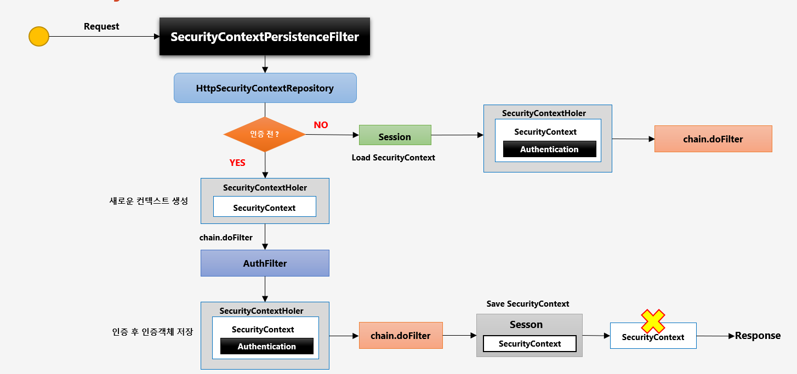
1. 사용자가 요청 
2. SecurityContextPersistenceFiler
   + 매 요청마다 (인증전, 인증후, 익명사용자)
   + HttpSecurityContextRepository
     + SeurityContext 를 생성하고 조회하는 클래스 
3. 인증 전 (익명사용자도 포함)
   + SecurityContextHolder (새로운 컨텍스트 생성)
     + Authentication은 null이다.
   + AuthFilter 
     + usernameAuthenticationFilter 인증 
   + 인증 후 인증 객체 생성 
     + `SeurityContext`의 결과`Authentication`를 정보를 저장 
   + 다음 필터로 이동 
   + `Session` 에 `SecurityContext`를 `SecurityContextpersistenceFilter`
   + SecurityContextHolder.clearContext();
   + 응답 
4. 인증 후 
   + session 에서 SecurityContext 정보를 `SecurityContextHolder` 
   + 다음 필터 진행
   
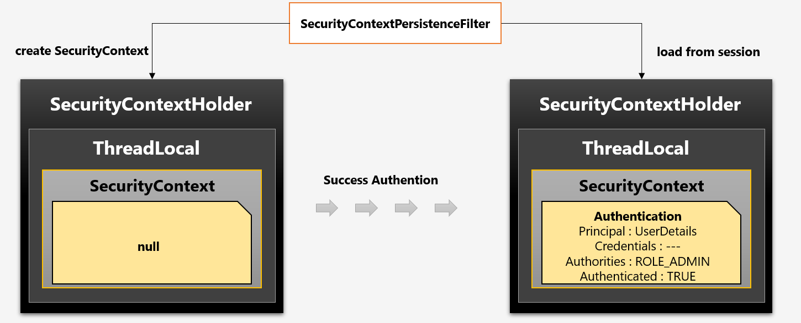
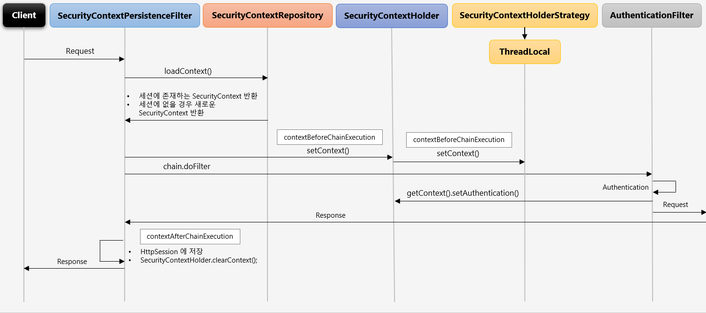
## 6. Authentication

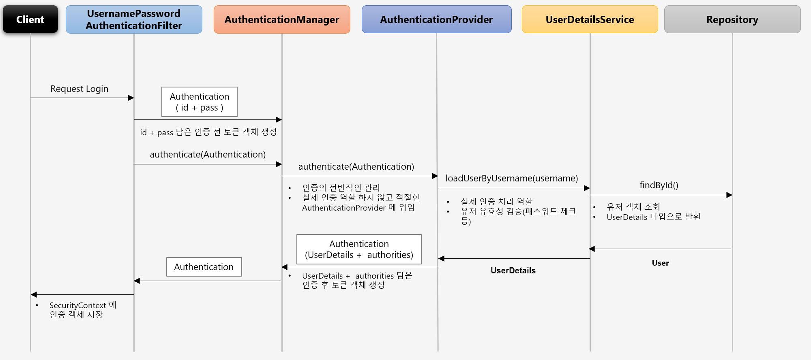

1. 사용자가 로그인 요청
2. `UsernamePasswordAuthenticationFilter`
   1. Autthntication(id+ password) 인증 처리 요청 
3. 요청을 받은 `AuthenticationManager` 
   1. 인증에 전반된 관리자
   2. 실제 인증을 처리하지 않고 `AuthenticationProvider` 위임 
4. `AuthenticationProvider`
   1. `loadUserByUserName`
      1. 실제 인증처리 역할
      2. 유저 유효성 검증 (패스워크 체크)
5. userDetailsService (인터페이스)
   1. 유저 객체조회 
   2. `userDetails` 타입으로 반환 
6. `Authentication`과 데이터를 저장해서 리턴 `Authentication`을 `SecurityContext` 에 저장

## 7. AuthenticationManager
1. 
2. `AuthenticationManager` 인터페이스를 구현한 `ProviderManager`  입니다.
3. AuthenticationProvider  목록 중에서 인증처리 요건에 맞는 AuthenticationProvider를 찾아 인증 처리를 한다.
4. `ProviderManager`는 초기화 시점에 여러개의 `AuthenticationProvider`를 가지고 있습니다.

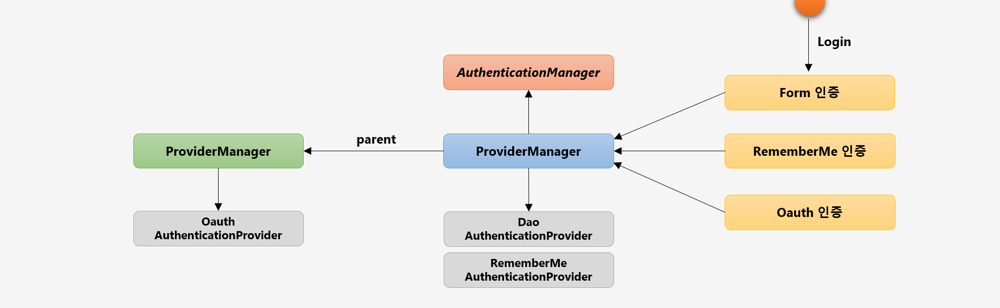

1. 실제 사용자 로그인요청 
   1. 여러방식의 인증방식이 있다.
      1. Form인증
      2. RememberMe 인증
         1. usernameAuthenticationFilter
         2. RememberMeAuthenticationFilter
            1. `Authentication` 객체를 `AuthenticationManager`에게 전달합니다.
            2. `ProviderManager`에서 처리하는 것이 아닌 다른 `AuthenticationProvider`를 이용하여 검증을 진행합니다.
      3. Oauth 인증
         1. `providerManager`에게 `Oauth`를 인증한 `provider`를 찾습니다.
         2. 자신이 가진 `provider`에서 존재하지 않는다면 `ProviderManager` `parent` 를 구현한 클래스에서 확인해서 인증을 처리합니다.
         ```java
            private AuthenticationManager parent;
         ```

## 8. AuthenticationProvider 
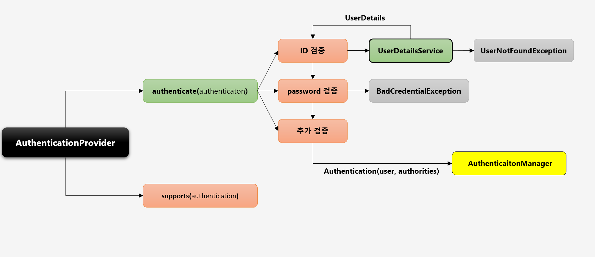
+ 실제적인 사용자의 데이터 검증

1. AuthenticationProvider(인터페이스)
   1. authenticate(authentication) // 인증처리 검증
      + ID 검증 
        + UserDetailsService 
          + data로부터 실제 사용자의 계정이 존재하는지 조회
            + 존재하지 않다면 `UserNotFoundException`
      + PASSWORD 검증
        + UserDetails 받은정보와 `authentication`으로 부터 받은 정보와 함께 비교 
          + 비밀번호가 동일하지 않다면 `BadCredentialException`
      + 추가검증까지 정리하게되면 
   2. `AUthentication` 인증된 정보를 `AuthenticationManager` 로전달
   3. `AuthenticationManager`로부터 받은 정보를 전달했던 `UsernamePasswordAuthenticationFilter`로 전달
   4. `SecurituContext`에 저장하고 `session`에 저장하는 방식으로 진행됩니다.
  1. supports(authentication) //현재 `form 인증`, `rememberme` 인증을 하수 있는지 검사
  
## 9. Authorization
+ 당신에게 무엇이 허가 되었는지 증명하는 것.
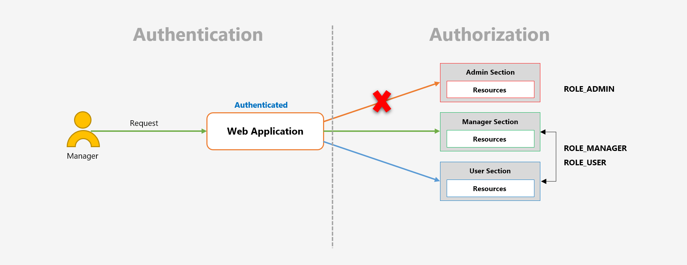

1. 인증을 사용한 사용자가 그 자원에 접근할 수 있는 자격이 있는지 확인하는 거라고 볼 수 있습니다.

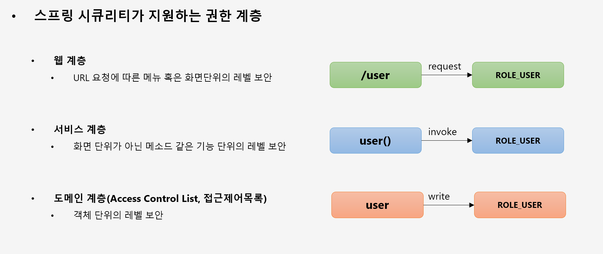


## 9.FilterSecurityInterceptor
+ 마지막에 위치한 필터로써 인증도니 사용자에 대하여 특정 요청의 승인/거부 여부를 최종적으로 결정 
+ 인증 객체 없이 보호자원에 접근을 시도할 경우 `AuthenctionException`을 발생 
+ 인증 후 자원에 접근 가능한 권한이 존재하지 않을 경우 `AccessDeniedException`을 발생 
+ 권한 제어 방식중 HTTP 자원의 보안을 처리하는 필터 
+ 권한 처리를 `AccessDecisionManager`에게 맡김

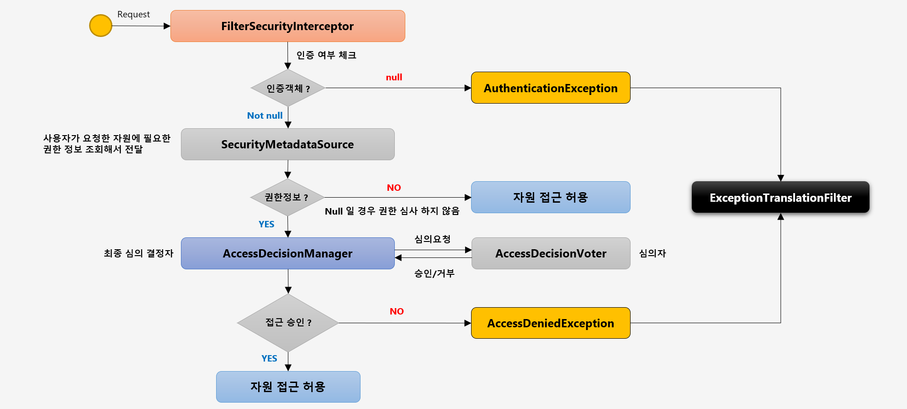

1. 사용자가 요청
2. `AbstractSecurityInterceptor`를 상속한 `FilterSecurityInterceptor`가 인증여부 체크 
```java

public class FilterSecurityInterceptor extends AbstractSecurityInterceptor {
    //부모 클래스를 호출 
    InterceptorStatusToken token = super.beforeInvocation(filterInvocation);
}


public abstract class AbstractSecurityInterceptor {
	protected InterceptorStatusToken beforeInvocation(Object object){
        // 자원의 설정된 `권한정보`를 가져옴 hasRole permitALl을 말함
        Collection<ConfigAttribute> attributes=this.obtainSecurityMetadataSource().getAttributes(object);

        // 인증된 사용자인지 확인 부분 
        if (SecurityContextHolder.getContext().getAuthentication() == null) {
        }
        // `AccessDecisionManger`
        attemptAuthorization(object, attributes, authenticated);
    }
}
```
   1. 인증 안 된경우
      1. AuthenctionException을 발생 
      2. ExceptionTranslationFilter 로 리턴 
   2. 인증 된경우 
      1. `SecurityMetadataSource` **(인가에 대한 처리)**
         + 사용자가 요청한 자원에 필요한 권한 정보 조회해서 전달 
           1. 사용자가 요청한 자원에 권한 자체가 없다면 심사하지 않음
           2. 권한정보가 존재한다면 `AccessDecisionManager`에게 최종 심의 요청
      2. `AccessDecisionManger`
         + 심의요청을 `AccessDecisionVoter` 확인 
         + 심의된 승인/거부 값을 `AccessDecisionManger` 정보를 받게된다.
         + 받게된 정보를 가지고서 승인과 거부에 따라 로직을 처리하게 된다.
           1. 접근 승인이 안된다면 `AccessDeniedException`
           2. 승인되면 `자원접근`

## 10.AccessDecisionManager
1. `인증정보, 요청정보, 권한정보`를 이요해서 사용자의 자원접근을 허용할 것인지 거부할 것이지 최종 결정하는 주체 
2. 여러개의 Voter들을 가질 수 있으면 Voter로 부터 `접근허용, 거부, 보류`에 해당하는 각각의 값을 리턴받고 판단 및 결정
3. 최종 접근 거부시 예외 발생 

### 접근결정의 세가지 구현체 
1. `AffirmativeBased`
   + 여러개의 Voter 클래스 중 하나라도 접근 허가로 결론을 내면 접근 허가로 판단한다.
2. `ConsensusBased`
   + 다수표(숭인 및 거부)에 의해 최종 결정을 판단한다.
   + 동수일경우 기본은 접근 허가이거나 `allowIfEqualsGrantedDeniedDecisions`을 false로 설정할 경우 거부로 결정된다.
3. `UnanimousBased`
   + `모든 보터`가 만장일치로 접근을 승인해야하며 그렇지 않은경우 접근 거부


## 10.AccessDecisionVoter 

+ `판단을 심사`하는 것(위원)
+ Voter 가 권한 부여 과정에서 판단하는 자료
  + Authentication - 인증 정보(user)
  + FilterInvocation – 요청 정보 (antMatcher("/user"))
  + ConfigAttributes - 권한 정보 (hasRole("USER"))

+ 결정 방식 
  + ACCESS_GRANTED : 접근허용(1)
  + ACCESS_DENIED : 접근 거부(-1)
  + ACCESS_ABSTAIN : 접근 보류(0)
    + Voter 가 해당 타입의 요청에 대해 결정을 내릴 수 없는 경우


1.`FitlerSecurityInterceptor`가 `AccessDesisionManager`에게 인가처리를 위임
2. `AccessDesisionManager` 가 (`Authentication(인증정보),FilterInvocation(요청정보),configAttributes(권한정보)`)를 `AccessDecisionVoter`에게 권한 판단심사요청
3. Voter 가 결정방식에 따라 `AccessDecusionManage`에게 돌려줍니다.
   접근 허용인 경우
   FitlerSecurityInterceptor에게 전달
   접근 불가인 경우
   ExceptionTranslationFitler에게 전달


# 최종정리 

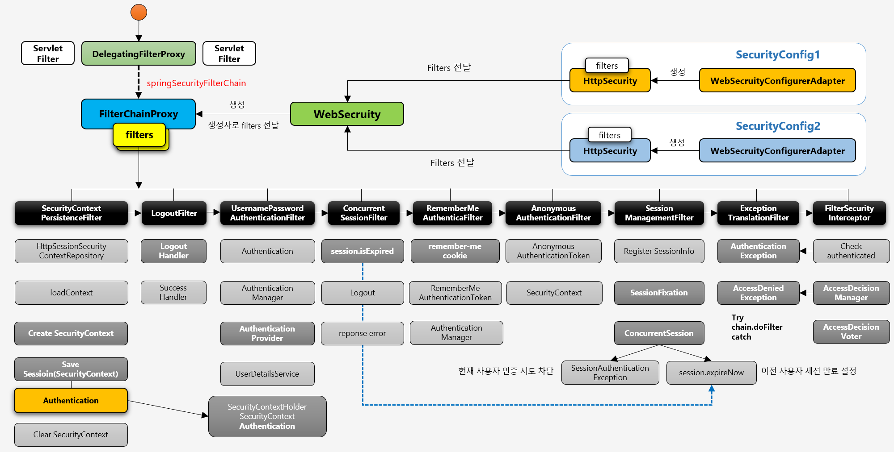
0. 시큐리티가 초기화 될때 일어나는 정보
   1. SecurityConfig `WebSecurityConfigurerAdapter`를 통해서 세롭게 설정해줄 수 있습니다.
   2. `Filter`를 생성하게 되고 Filter가 직접적인 설정을 처리하게됩니다.
   3. `WebSecurity` 로 각각의 설정된 filter 정보를 담게 됩니다. 
   4. `FilterChainProxy` 생성될 떄 `WebSecurity`의 `filter` 정보를 `생성자`로 주입받습니다.
   5. `filterChainProxy`는 `springSecurityFilterChain`이름으로 `bean` 등록되게 됩니다.
   6. `DelegatingFilterProxy(ServletFilter)` 초기화 시점에 `springSecurityFilterChain`이름의  bean인 `filterChainProxy` 를 찾습니다.
1. 유저가 인증을 시도하는 경우 
   1. 사용자가 인증을 요청 
   2. `DelegatingFilterProxy`가 요청을 받고 `filterChainProxy`에게 위임 합니다.
   3. `SecurityContextPersistenceFilter` 사용자의 요청을 받음
      1. `httpSessionSecurityContextRepository` 클래스 가지고 있습니다.
         1. `SecurityContext`를 생성 및 저장 , 조회하고 참조하는 역할 
      2. `loadContext` (`Session`에 저장된 이력이 있는지 체크)
         1. 최초의 인증이기 때문 Session에 정보가 없습니다.
         2. 정보가 없기 때문에 `CreateSecurityContext` 새로운 `SecurityContext`를 생성합니다.
   4. `LogoutFilter`
      1. 인증을시도하고 있는 중이기에 그냥 넘어갑니다.
   5. `UsernamePasswordAuthenticationFilter` (form 인증처리)
         1. `Authentication` 인증객체를 생성 
         2. `AuthenticationManager`가 `인증처리`를 `AuthenticationProvider`에게 위임합니다.
         3. 최종적으로 인증이 성공한경우 `SeuciryContextHolder` 안에 `SecurityContext` 를 저장하게됩니다.
            1. `SecurityContext` 안에는 `Authtication`이 담겨있는데 `ThreadLocal`에 담겨 저장되게 됩니다.
            2. !중요 SecurityContext는 이전단계인 `SecurityContextPersistenceFilter`에서 생성한 `SecurityContext`에 저장하게 됩니다.
   6. 위와 같은 인증이 일어나는 시점에 `SessionManagementFilter`에서 사용자가 이전 로그인을 인증한시도가 있었는지 체크를 진행하게 됩니다.
      1. `ConcurrentSession`
         1. `SessionAuthenticationException` //현재 사용자 인증시도 시도 차단
         2. `session.expireNow` // 이전 사용자 세션 만료 설정
      2. `sessionFixation`
         1. 새로운 세션 생성과 함께 새로운 쿠키를 발급하게 됩니다.
      3. `RegisterSessionInfo`를통해 사용자 세션정보가 등록됩니다.
   7. 이후 로그인이 성공하는 경우 
    `SecurityContextPersistenceFilter` 응답전에 `HttpSession`에 저장하게 되고 현존하는 `SecurityContext`를 삭제하게 됩니다.
   
2. 인증 이후 자원에 접근하는 경우 
    1. 사용자의 요청 
    2. `DelegatingFilterProxy`가 요청을 받고 `filterChainProxy`에게 위임 합니다.
    3. `SecurityContextPersistenceFilter` 사용자의 요청을 받음
       1. `httpSessionSecurityContextRepository` 클래스 가지고 있습니다.
       2. `SecurityContext`를 생성 및 저장 , 조회하고 참조하는 역할
    4. `loadContext` (`Session`에 저장된 이력이 있는지 체크) 
       1. `사용자 인증했던 정보가 존재 session에서 정보를 꺼내옵니다.`
       2. 해당정보를 `SecurityContextHolder`에 `저장`하게 됩니다. 생성은 하지 않습니다.
    5. `ConcurrentSessionFilter` 까지 필터 통과 (동일한계정으로 두명이상이 들어오는경우 동작)
    6. `RememberMeAuthenticationFIlter` 
       1. 사용자의 세션 만료가 된 경우 `인증객체가 null`인경우 종작 
       2. remember-me cookie 값을 저장해서 왔을 때 인증처리를 하게 됩니다.
    7. `AnonymousAuthenticationFilter`
        1. 사용자가 인증시도하지 않고 권한도없이 자원에 바로 접근하려하는 경우 
    8. `SessionManagementFilter` 현재 세션에 `SecurityContext`가 없는 경우 동작
       1. 인증에서 해당 기능과 동일한 일을하지만 별로로 filter로서 동작합니다.
    9. `ExceptionTranslationFilter`
       1. 예외만 처리하는 필터 
           1. AuthenticationException
           2. AccessDenideException
    10. FilterSecurityInterceptor
        1. 현재 접속한 사용자가 Authentication의 정보가 `SecurityContext` 정보가 있는 없다면 `AuthenticationException` 발생
        2. `AccessDecisionManager`가 AccessDecisionVoter로 승인과 거부 결정을 위임시킵니다.
           1. 만약 권한이 없는 요청이라면 `AccessDeniedException`을 발생시킵니다.

3. 첫번째와 동일한 계정으로 인증을 시도하는 경우 
    1. 사용자의 요청
    2. `DelegatingFilterProxy`가 요청을 받고 `filterChainProxy`에게 위임 합니다.
    3. `SecurityContextPersistenceFilter` 사용자의 요청을 받음
        1. `httpSessionSecurityContextRepository` 클래스 가지고 있습니다.
        2. `SecurityContext`를 생성 및 저장 , 조회하고 참조하는 역할
    4. `loadContext` (`Session`에 저장된 이력이 있는지 체크) 
       1. `사용자 인증했던 정보가 존재 session에서 정보를 꺼내옵니다.`
       2. 해당정보를 `SecurityContextHolder`에 `저장`하게 됩니다. 생성은 하지 않습니다.
    5. `ConcurrentSessionFilter`
       1. 매요청 마다 세션이 만료되었는지 확인합니다.
          1. session.expireNow();
       2. ConcurrentSession에서 2가지 전략을 가지고서 확인하게 됩니다.
          1. SessionAuthenticationException //현재 사용자의 인증시도를 차단 처리
          2. session.expireNow // 계속 인증을 성공하지만, 이전 세션은 삭제하게 됩니다.
             1. 루트페이지로 이동하게됩니다.
4. 